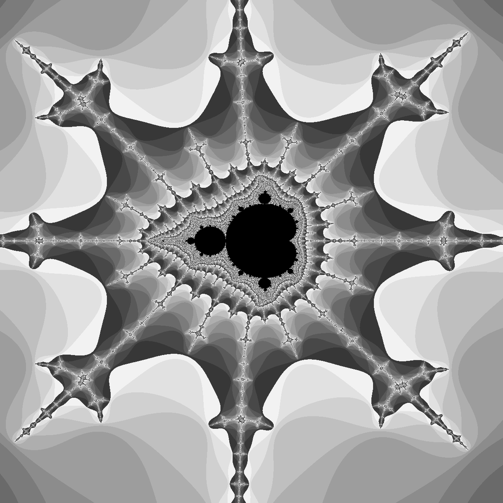
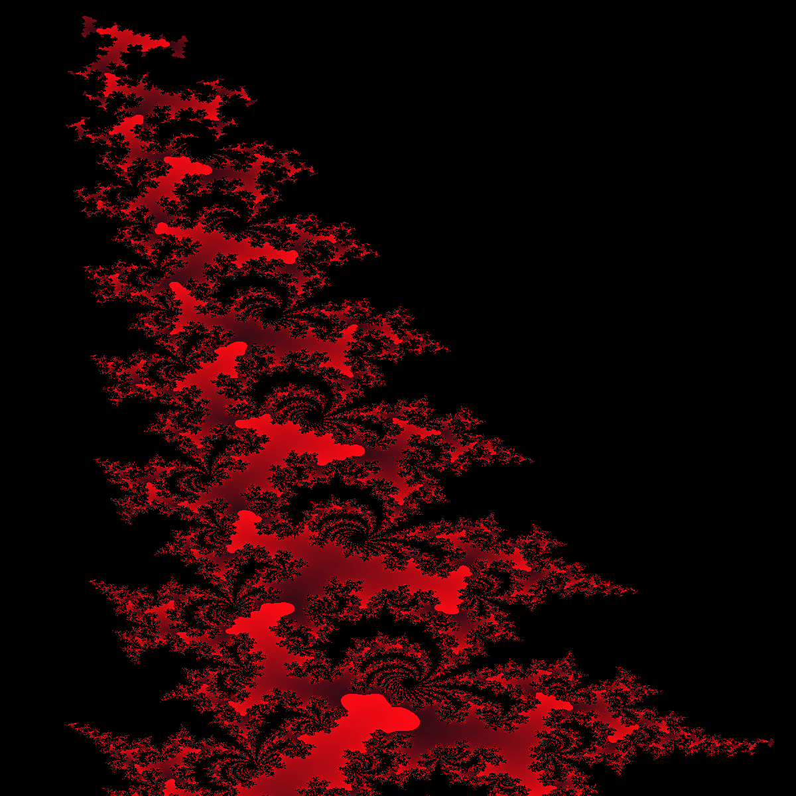

# MandleGrot 0.1.1

A React application for calculating familiar Mandlebrot sets images.

The following images were created using the tool:

## Technical Details

The images are generated in two phases:

1. Iteration data calculation - a pool of web workers (threads) is constructed. Each worker calculates the iteration
   data for a given line of the final image at a time. The workers delegate to functions written in WebAssembly script
   and write their results to shared memory.
2. Colourisation - a WebAssembly non-shared memory is constructed to back an ImageData object. The iteration data is
   copied into this memory and colourised by another WebAssembly based function. The ImageData object is rendered
   directly onto an HTML canvas.

This two phase implementation allows the re-colourisation of images without needing to regenerate them at the expense of
approximately twice the memory overhead.

## Running (development)

### `npm start`

## Running (optimised production build)

### `npm run serve`

## Testing

### `npm test`

## Links

- The [WebAssembly scripts](https://github.com/chrisdenman/mandlebrot-wot) that implement: the Mandlebrot calculations
  and, colourisation.

## Future Work

- Change the iteration data buffer to use 16 bit words?
- Triggering query parameters?
- Create a decent UI.
    - Maybe full screen (scrollable) image with floating controls?
    - Improve the colour management: editable colours, add/remove functionality.
- A render history stack so the user can go back to previous results.
- Showing the region dimensions on the drag operations.
- User-friendly image saving (with details on the extents maybe).

## ToDo

- Sort out the publication of the dependencies and host it.
- Validate the region boundaries for integral and continuous ranges, make sure endpoints are correct
- Improve the project structure
- Update version and check in, add some better pictures
- Input validation could be better, still render the canvas when max modulus is erroneous e.g.
    - perhaps a separate states for dimensions and other validity?
- Handle failures properly: memory and worker construction in particular.
- Sort out the NaN state transition issue when inputs are not valid.

## Queries

- How to include the wasm via module imports?
- In App.#windowCursorLocation, why do we need to use the min function?
- Why do we have to pass maxIterationCount - 1 to the colourisation routines? 

## Version History

See [Version History](./VERSIONS.md)

## Licensing

The [Unlicense](https://unlicense.org/)
